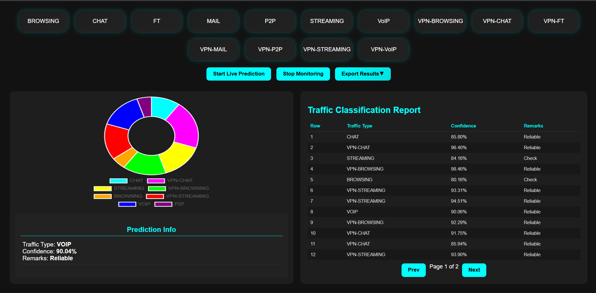

# Multi-UE VPN Traffic Classification - Stacking Ensemble

## Table of Contents

- [Problem Statement]
- [Project Overview]
- [Dataset]
- [Feature Engineering]
- [Model Architecture]
- [Usage]
    - Option 1: Running with Docker
    - Option 2: Running without Docker (Local Python Environment)
- Repository Structure
- License

---

## Problem Statement

This project aims to classify **user application traffic** in a Multi-UE (User Equipment) connected network scenario. Applications behave differently under varying traffic conditions, channel states, and coverage scenarios. Categorizing UE traffic into broad categories such as **Video Streaming, Audio Calls, Video Calls, Gaming, Video Uploads, Browsing, Texting, etc.** enables the network to provide differentiated and optimized QoS (Quality of Service) for each traffic type. This project develops an AI-based model to analyze traffic patterns and predict application categories with high accuracy.

---

## Project Overview

This repository contains the code and trained models for classifying Multi-UE VPN traffic using a **stacking ensemble approach**. The ensemble combines **XGBoost, LightGBM, and Logistic Regression** to improve classification accuracy, especially for imbalanced network traffic datasets. The web application is built using **Flask**, enabling real-time traffic monitoring and visualization.

---

## Dataset

- **Samples**: Approximately 55,000
- **Features**: 13 features capturing flow and network metrics
- **Classes**: 14 classes including VPN and non-VPN traffic types

---

## Feature Engineering

- **Ratio Features**: e.g., bytes per packet, packets per duration
- **Log-Transformed Features**: Reduces skew in distribution and improves model performance
- **Interaction Features**: Captures complex relationships between flow metrics
- **Normalized and Aggregated Features**: Provides composite metrics for improved classification accuracy

---

## Model Architecture

- **StackingClassifier** combining:
    - **XGBClassifier**
    - **LGBMClassifier**
    - **Logistic Regression** as the final estimator

The stacking ensemble leverages the strengths of each base model to improve predictive performance across all traffic classes.

---

## Results

- **Accuracy**: 97.5%
- **Balanced Accuracy**: 97.24%
- Detailed classification metrics and the confusion matrix are available in the `docs` folder.

---

## Usage

### Option 1: Running with Docker

1. Clone the repository

```bash
git clone <repository_url>
# Navigate to the src folder. 
cd src
```

2. Build the Docker image:

```bash
docker build -t multi-ue-traffic-app .
```

3. Run the Docker container:

```bash
docker run -p 5000:5000 multi-ue-traffic-app
```

4. Access the web application in your browser:

```
http://localhost:5000
```

The included `run.sh` script handles container startup and port mapping automatically.

---

### Option 2: Running without Docker (Local Python Environment)

1. Navigate to the `src` folder and Create a virtual environment (optional but recommended):

```bash
python -m venv venv
# On Windows
venv\Scripts\activate
# On Linux/Mac
source venv/bin/activate
```

2. Install required Python packages:

```bash
pip install -r requirements.txt
```

3. Navigate to the `src` folder and run the Flask app:

```bash
python app.py
```

4. Open your browser and access the web application:

```
http://localhost:5000
```

---

## Screenshots

### Dashboard



---

## Repository Structure

```
AI-Multi-UE-Traffic-Analyzer/
│── docs/                        
│   ├── model_architecture.png     # Model architecture diagram
│   ├── flow_diagram.png             # Data flow diagram
│   ├── technical_report.pdf         # Full project report
│   └── README.md                    # Documentation for the overall project
│
│── src/                           
│   ├── app.py                       # Main Flask application
│   ├── preprocess.py                # Data preprocessing scripts
│   ├── feature_engineering.py       # Feature engineering scripts
│   ├── interface.py                 # Application interface logic
│   ├── model.joblib                 # Trained stacking model
│   ├── network_traffic_dataset.xlsx # Network traffic dataset
│   ├── templates/                   # HTML templates
│   ├── static/                      # CSS, JS, images
│   ├── Dockerfile                   # Docker configuration
│   ├── requirements.txt             # Python dependencies
│   ├── run.sh                        # Docker container startup script
│   └── README.md                    # App-specific documentation
│
│── LICENSE                          # MIT License
│── README.md                        # Overall project documentation

```

---

## License

This project is licensed under the **MIT License**. See the LICENSE file for details.
