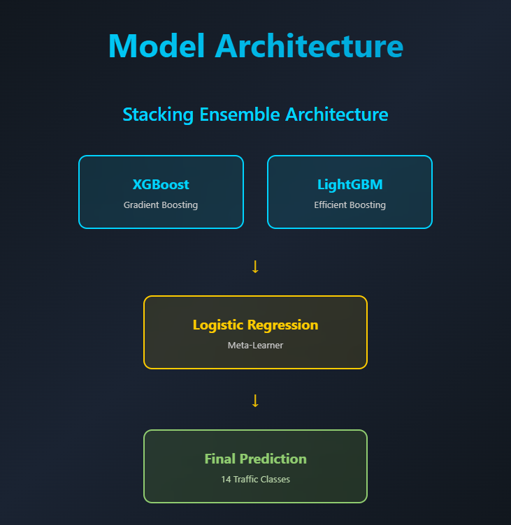
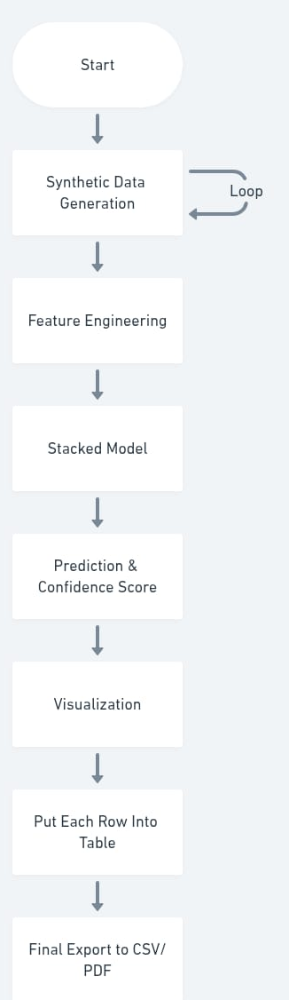

## Architecture

- Stacking ensemble model combining XGBoost, LightGBM, and Logistic Regression.
- Features: Flow-based metrics, log-transforms, interaction features, ratios, and aggregated statistics.
- Input: Real-time network traffic metrics.
- Output: Predicted traffic type, confidence, and recommended action.

---

## Data Flow

1. Collect network traffic metrics from multiple UEs.
2. Preprocess and feature engineering using `preprocess.py` and `feature_engineering.py`.
3. Model predicts traffic type and confidence.
4. Web interface displays results and allows export (PDF/CSV).

---

## Results

- Accuracy: 97.5%
- Balanced Accuracy: 97.24%
- Detailed classification report and confusion matrix included in `documentation_report.pdf`.
- This file is a PDF (binary format), so it can't be rendered as a code block. Code blocks only work for text/code files. 
- If you want to view a PDF or other binary file, you should download and open it with a compatible viewer (like Adobe Reader for PDFs).

---

## Usage

- For running the app, refer to `src/README.md`.