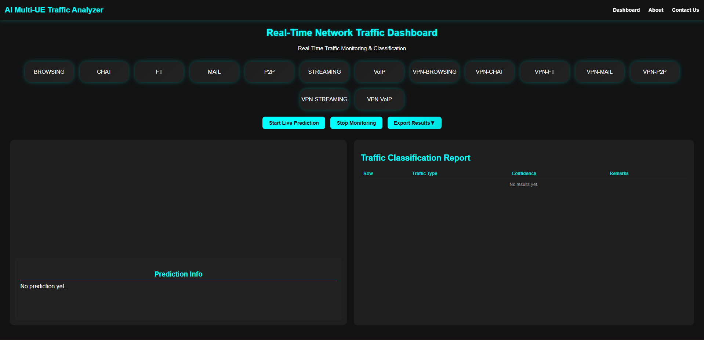
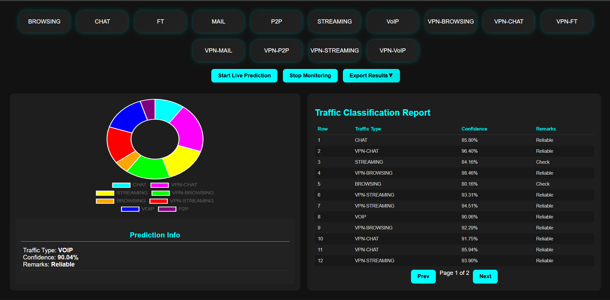

# AI Multi-UE Traffic Analyzer – Web Application

## Overview

For this project, we developed a **web application** to classify Multi-UE network traffic using an AI model. The app provides a **dashboard** to visualize predictions, confidence levels, and recommended actions for different traffic types.

---

## Technology Stack

- **Backend:** Python, Flask
- **Frontend:** HTML, CSS, JavaScript
- **Machine Learning:** Stacking ensemble (XGBoost, LightGBM, Logistic Regression)
- **Deployment:** Docker (optional)

---

## Application Structure

The folder contains the following key components:

| File / Folder | Purpose |
| --- | --- |
| `app.py` | Main Flask application, handles routes and model integration |
| `preprocess.py` | Data preprocessing scripts |
| `feature_engineering.py` | Feature generation for the model |
| `interface.py` | Maps predictions to labels and actions |
| `model.joblib` | Trained stacking model |
| `network_traffic_dataset.xlsx` | Sample dataset for testing |
| `templates/` | HTML pages (dashboard, about, contact) |
| `static/` | CSS, JS, images |
| `Dockerfile` | Docker configuration |
| `requirements.txt` | Python dependencies |
| `run.sh` | Script to start the app via Docker |

---

## Running the Application

### Option 1: Using Docker

```bash
git clone <repository_url>
# Navigate to the src folder
cd src
docker build -t multi-ue-traffic-app .
docker run -p 5000:5000 multi-ue-traffic-app
# Open: http://localhost:5000
# After Accessing the web application, Then remove the docker process:
```bash
sudo docker ps
sudo docker stop image_name/image_id
sudo docker rm image_name/image_id
```


### Option 2: Local Python Environment

```bash
git clone <repository_url>
# Navigate to the src folder
cd src
python -m venv venv
# Activate environment:
# Windows: venv\Scripts\activate
# Linux/Mac: source venv/bin/activate
pip install -r requirements.txt
python app.py
# Open: http://localhost:5000
```

---

## Dashboard Features

- Displays **real-time traffic predictions** for multiple UEs
- Shows **confidence levels** and recommended actions
- Provides **interactive visualization** for better understanding of network traffic



